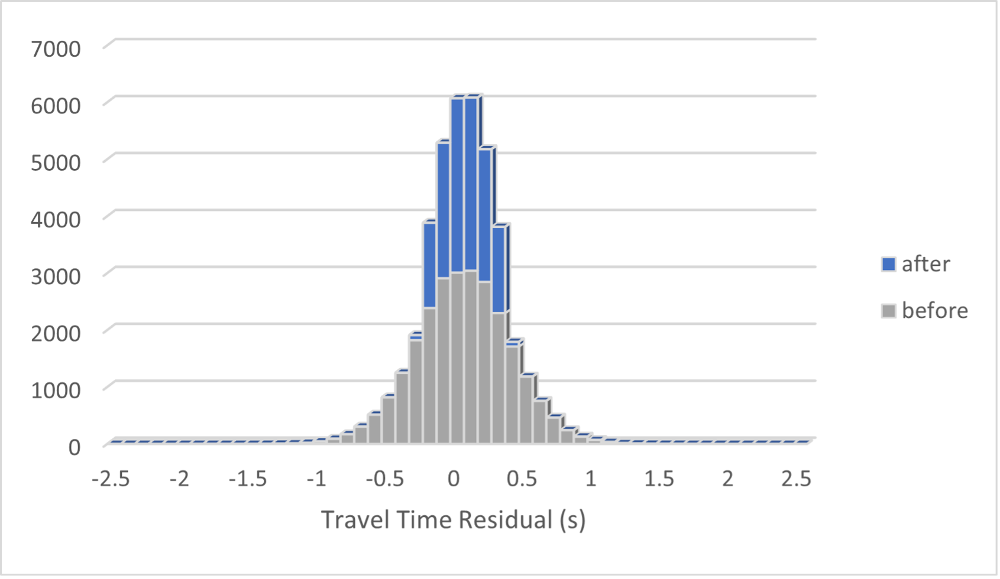
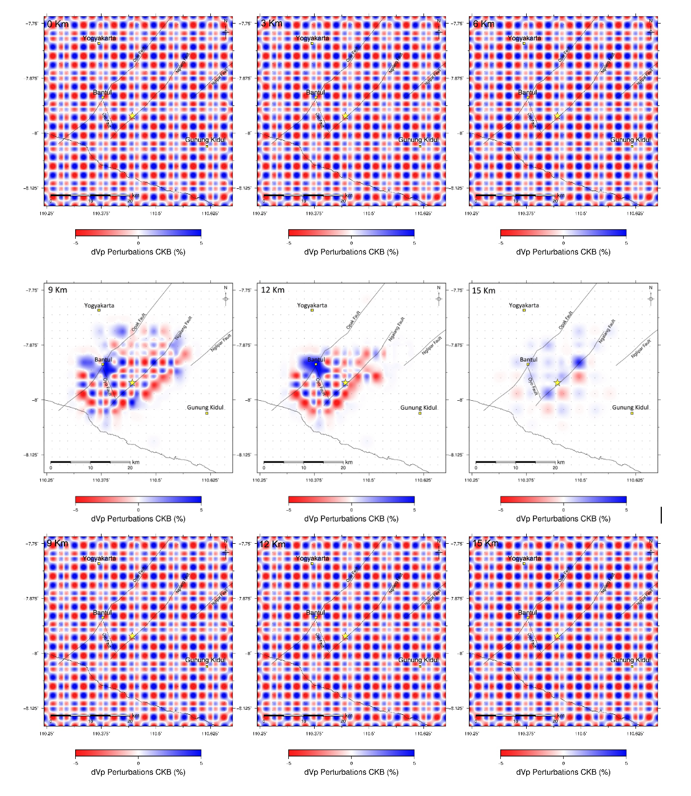

## 📘 Supplementary Material (Velocity Model via RF Modeling)

# Detailed Seismic Structure Beneath the Opak Fault Zone, Yogyakarta, Indonesia: Evidence for an Interconnected Fault System and Implications for Seismic Hazard 

**Authors:** Rahmat Setyo Yuliatmoko, Wiwit Suryanto, Mochamad Nukman, Muzli Muzli, Ayu Krisno Ekarsti, Virga Librian, Mohamad Ramdhan, Andry Syaly Sembiring, Muhajir Anshori, Dwikorita Karnawati

 **Figure 1.** Histogram of Travel Time Residuals 
**Figure 2.** The initial CKB model and recovery CKB for each horizontal slice 
* [cite_start]**Figure 3:** Vertical Cross Section of the Chessboard Resolution Test from West to East (AA' to E–E′) [cite: 8]
* [cite_start]**Figure 4** shows the horizontal cross-section of the DWS component Vs at a depth of 0–30 km. [cite: 9]
* [cite_start]**Figure 5** shows a horizontal cross-sectional view of the DWS Vp/Vs component at a depth of 0–30 km. [cite: 10]
* [cite_start]**Figure 6.** Horizontal tomogram of the Vp component at a depth of 0–30 km. [cite: 11]
* [cite_start]**Figure 7** shows a horizontal tomogram of the Vs component at depths ranging from 0 to 30 km. [cite: 12]
* [cite_start]**Figure 8** shows a horizontal tomogram of the Vp/Vs component over the depth range 0-30 km. [cite: 13]
* [cite_start]**Figure 9** Cross-section tomogram lines from F-F′ to J-J′ display vertical profiles of Vp, Vs, and Vp/Vs tomograms. [cite: 14] [cite_start]The Vp data is on the left, Vs in the centre, and Vp/Vs on the right. [cite: 15]

### [cite_start]TABLE 1: Results of Receiver Function Calculations in Yogyakarta [cite: 16]

| Station | Longitude | Latitude | H (Meter) | Crustel (Km) | Vp/VS (km/s) |
|---|---|---|---|---|---|
| ANT01 | 110.377 | -7.697 | 302 | 28.1 | 1.75 |
| ANT02 | 110.361 | -7.729 | 213 | 27.4 | 2 |
| ANT03 | 110.344 | -7.779 | 160 | 27.6 | 1.54 |
| ANT04 | 110.542 | -7.77 | 175.9 | 29.4 | 1.702 |
| ANT05 | 110.309 | -7.855 | 153 | 26.2 | 1.659 |
| ANT07 | 110.265 | -7.942 | 49 | 28.6 | 1.97 |
| ANT08 | 110.396 | -7.929 | 71 | 30.5 | 1.75 |
| ANT09 | 110.415 | -7.711 | 279.2 | 25.1 | 1.5 |
| ANT10 | 110.4 | -7.756 | 192 | 27.6 | 1.97 |
| ANT11 | 110.382 | -7.797 | 142 | 27.6 | 1.58 |
| ANT14 | 110.314 | -7.932 | 60 | 27.5 | 1.809 |
| ANT15 | 110.307 | -7.956 | 45 | 27.6 | 1.83 |
| ANT17 | 110.461 | -7.733 | 206 | 29.1 | 1.5 |
| ANT18 | 110.442 | -7.773 | 164 | 31.5 | 1.931 |
| ANT19 | 110.424 | -7.815 | 111 | 31.2 | 1.53 |
| ANT20 | 110.403 | -7.855 | 75.4 | 27.3 | 1.5 |
| ANT24 | 110.335 | -8.021 | 97 | 28.2 | 1.5 |
| ANT27 | 110.462 | -7.839 | 137 | 32.9 | 1.83 |
| ANT29 | 110.431 | -7.911 | 199 | 32.7 | 1.601 |
| ANT30 | 110.405 | -7.96 | 256 | 31.8 | 1.859 |
| ANT31 | 110.385 | -7.996 | 372 | 29.5 | 1.911 |
| ANT32 | 110.37 | -8.037 | 255 | 28.5 | 1.831 |
| ANT33 | 110.319 | -7.818 | 112 | 28.3 | 1.53 |
| ANT34 | 110.522 | -7.81 | 320 | 31.1 | 1.76 |
| ANT35 | 110.507 | -7.85 | 305 | 32.2 | 1.831 |
| ANT37 | 110.47 | -7.935 | 219 | 32.3 | 1.9 |
| ANT38 | 110.453 | -7.982 | 192 | 32.1 | 2 |
| ANT39 | 110.376 | -7.972 | 213 | 28.5 | 1.718 |
| ANT40 | 110.42 | -8.044 | 316 | 28.3 | 1.579 |
| ANT41 | 110.583 | -7.789 | 152 | 28.2 | 1.5 |
| ANT42 | 110.568 | -7.826 | 400 | 28.7 | 1.529 |
| ANT43 | 110.544 | -7.872 | 181 | 31.6 | 1.9 |
| ANT45 | 110.521 | -7.957 | 206 | 30.5 | 1.66 |
| ANT46 | 110.493 | -7.996 | 183 | 30.2 | 1.529 |
| ANT47 | 110.463 | -8.039 | 313 | 30.4 | 1.841 |
| ANT48 | 110.453 | -8.075 | 174 | 30.4 | 1.82 |
| ANT49 | 110.62 | -7.812 | 367.9 | 31.3 | 1.77 |
| ANT50 | 110.469 | -7.763 | 170 | 28.8 | 1.519 |
| ANT51 | 110.586 | -7.891 | 202 | 31.7 | 1.7 |
| ANT52 | 110.569 | -7.933 | 231 | 28.5 | 1.968 |
| ANT53 | 110.547 | -7.974 | 193 | 31.2 | 1.99 |
| ANT54 | 110.529 | -8.015 | 147.9 | 30.7 | 2 |
| ANT55 | 110.512 | -8.061 | 319 | 31.4 | 1.761 |
| ANT56 | 110.504 | -8.094 | 156 | 30.2 | 1.968 |
| ANT57 | 110.337 | -7.68 | 300.9 | 28.2 | 1.666 |
| ANT58 | 110.317 | -7.716 | 210 | 28.5 | 1.5 |
| ANT59 | 110.295 | -7.76 | 119.5 | 29.3 | 1.792 |
| ANT60 | 110.336 | -7.948 | 48 | 28.8 | 1.744 |
| ANT61 | 110.259 | -7.838 | 130 | 28.3 | 1.709 |
| ANT62 | 110.241 | -7.88 | 85.1 | 28.7 | 1.5 |
| ANT63 | 110.228 | -7.918 | 62 | 28.6 | 1.75 |
| ANT64 | 110.208 | -7.962 | 107 | 28.5 | 1.63 |
| ANT71 | 110.394 | -7.876 | 77 | 27.3 | 1.59 |
| ANT72 | 110.59 | -7.659 | 275.1 | 33.5 | 1.631 |
| ANT74 | 110.476 | -7.691 | 321 | 27.8 | 1.521 |
| ANT75 | 110.22 | -7.988 | 29 | 27.2 | 1.519 |
| ANT76 | 110.539 | -7.67 | 321 | 34.9 | 1.72 |
| ANT77 | 110.519 | -7.711 | 261 | 34.7 | 1.862 |
| ANT78 | 110.581 | -7.691 | 213 | 31.2 | 1.5 |
| ANT79 | 110.561 | -7.729 | 194 | 29.8 | 2 |
| ANT80 | 110.638 | -7.665 | 203 | 29.3 | 1.86 |
| ANT81 | 110.622 | -7.706 | 177 | 28.4 | 1.778 |
| ANT82 | 110.603 | -7.748 | 162 | 29.7 | 1.52 |
| ANT84 | 110.662 | -7.725 | 150 | 30.8 | 1.77 |
| ANT85 | 110.643 | -7.767 | 147 | 34.5 | 1.79 |
| ANT86 | 110.437 | -7.94 | 267 | 35.2 | 1.79 |
| ANT87 | 110.456 | -7.901 | 325 | 36.7 | 1.97 |
| ANT88 | 110.473 | -7.864 | 408 | 36.5 | 1.971 |
| ANT89 | 110.537 | -7.836 | 383 | 32.3 | 1.56 |
| ANT91 | 110.497 | -7.924 | 195 | 36.4 | 1.95 |
| ANT92 | 110.363 | -7.998 | 386 | 30.6 | 1.66 |
| ANT93 | 110.464 | -8.001 | 177 | 30.4 | 1.737 |
| ANT94 | 110.548 | -7.799 | 241 | 32.31 | 2 |
| ANT95 | 110.375 | -8.071 | 100 | 28.32 | 1.52 |
| BOJI | 110.689 | -7.568 | 196 | 28.42 | 1.54 |
| BPJI | 109.997 | -7.81 | 64 | 27.5 | 1.73 |
| DWIKO | 110.414 | -8.01 | 361 | 28.87 | 1.92 |
| GKJM | 110.592 | -7.841 | 211 | 28.16 | 1.99 |
| MKJM | 110.483 | -7.663 | 410 | 22.6 | 1.88 |
| PRJI | 110.792 | -8.072 | 337 | 27.4 | 1.8 |
| SBJM | 110.266 | -7.968 | 17 | 23.8 | 1.5 |
| UGM | 110.523 | -7.913 | 350 | 25.2 | 1.98 |
| WOJI | 110.924 | -7.837 | 183.62 | 26.4 | 1.58 |
| YOGI | 110.295 | -7.817 | 176 | 23.0 | 1.759 |
